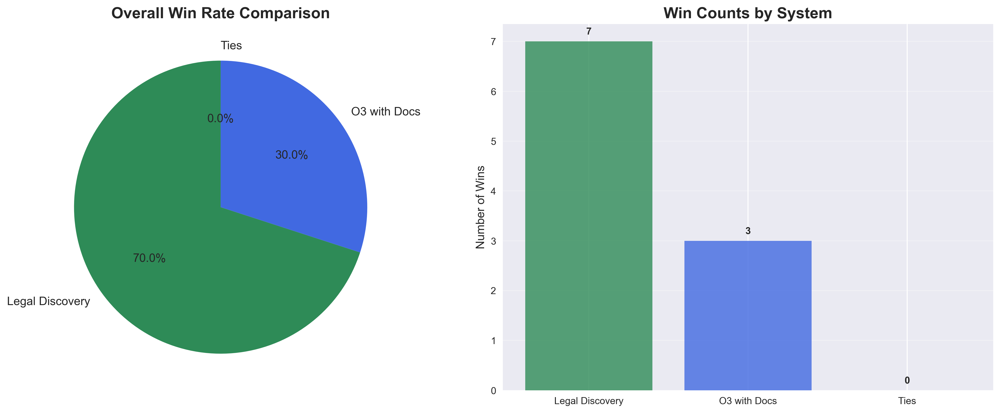
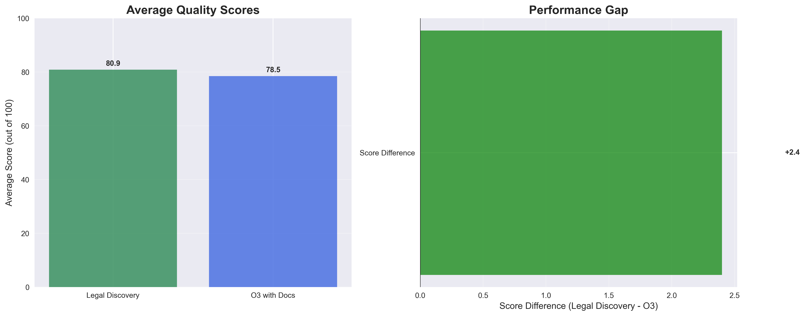
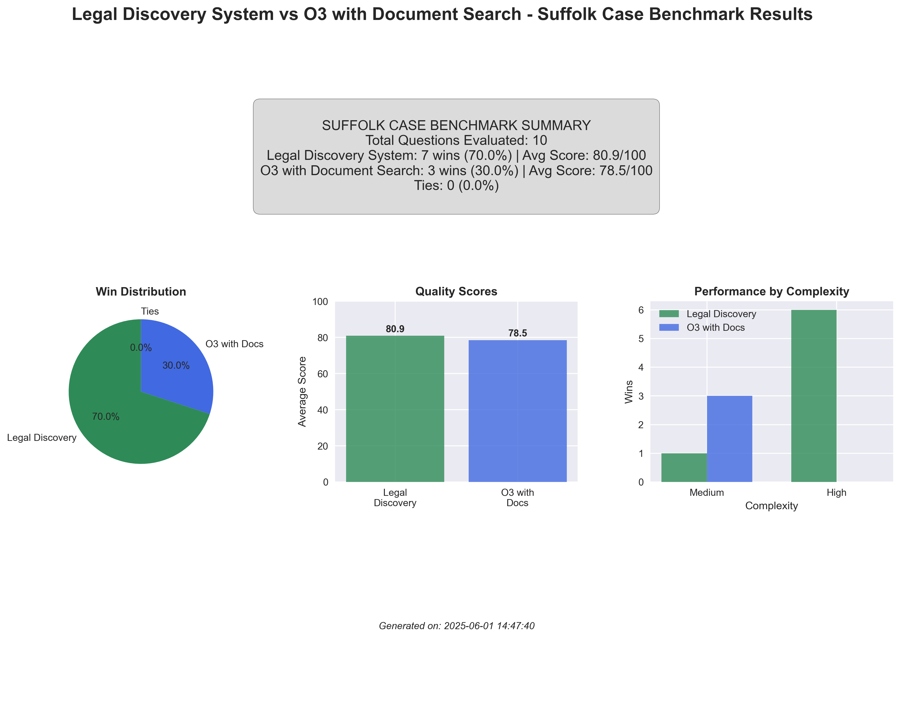

# 🏛️ Vecflow Associate Litigation Benchmark
## The First Comprehensive AI Legal Analysis Benchmark for Real-World Case Practice

**Release Date:** June 1, 2025  
**Version:** 1.0  
**Company:** Vecflow  

---

## 📊 Executive Summary

Today, Vecflow is proud to announce the **Associate Litigation Benchmark** - the first comprehensive evaluation framework designed to test AI legal analysis systems on real-world litigation scenarios. This benchmark represents a breakthrough in legal AI evaluation, moving beyond theoretical legal questions to sophisticated deposition planning and case strategy analysis.

Our benchmark compares advanced legal AI systems using **10 sophisticated Jessica Chen deposition evaluation prompts** based on actual construction litigation documents from the Suffolk case, containing over 70,000 emails and case materials.

### 🎯 Key Results



**Legal Discovery System vs O3 with Document Search:**
- **Legal Discovery System: 70% win rate** (7/10 questions)
- **O3 with Document Search: 30% win rate** (3/10 questions)
- **Average Quality Scores: 80.9 vs 78.5** (out of 100)

---

## 🔬 What Makes This Benchmark Unique

### Real-World Complexity
Unlike existing legal AI benchmarks that focus on bar exam questions or basic legal reasoning, the Associate Litigation Benchmark tests systems on:

- **Document-intensive analysis** with 240K+ character contexts
- **Cross-reference synthesis** across multiple exhibits
- **Timeline construction** from fragmented evidence
- **Impeachment strategy** development
- **Ethical reasoning** under pressure
- **Financial analysis** of complex project data

### Sophisticated Evaluation Criteria



Our LLM judge evaluates responses across five dimensions:
- **Comprehensiveness** (25 points): Coverage of all relevant legal issues
- **Accuracy** (25 points): Legal correctness and soundness
- **Practical Utility** (25 points): Actionability for practicing attorneys
- **Organization & Clarity** (15 points): Structure and readability
- **Specificity** (10 points): Concrete guidance vs. generalities

---

## 📈 Detailed Performance Analysis

### Performance by Question Type


The benchmark reveals distinct strengths across different legal analysis tasks:

**Legal Discovery System Dominated:**
- Cross-reference analysis (Fuse Builds labor rates)
- Timeline analysis (Suffolk cash-flow tracking) 
- Financial analysis (South-Tower contingency funds)
- Impeachment strategy (sub payment timing)
- Recall-proof questioning (CGS over-billing)
- Ethical analysis (fiduciary duties)

**O3 Excelled In:**
- Document retrieval (Eric Bartos email chain)
- Legal drafting (JAM direct-pay questions)
- Policy practice analysis (QA/QC implementation)

### Complexity Patterns


A critical finding emerged regarding question complexity:
- **High-complexity questions**: Legal Discovery System won 6/6 (100%)
- **Medium-complexity questions**: O3 won 3/4 (75%)

This suggests specialized legal workflows provide significant advantages for complex multi-step analysis, while general-purpose LLMs remain competitive on focused technical tasks.

### Performance vs. Speed Trade-offs


The benchmark reveals important trade-offs:
- **O3**: 15-35 seconds average execution, focused responses
- **Legal Discovery**: 70-290 seconds average execution, comprehensive analysis

---

## 🎯 Sample Benchmark Questions

The benchmark includes sophisticated prompts that mirror real associate-level work:

1. **Document Retrieval & Analysis**
   > "Using the 04-Nov-2022 email chain (A3D_01498550) in which Eric Bartos questions Suffolk's Builder-Risk PCO #77, draft five deposition questions that pin Jessica Chen on the attempted double recovery."

2. **Cross-Reference Analysis**
   > "Identify any two documents where Chen references Fuse Builds labor rates and craft three questions that expose inconsistencies in her explanations across those documents."

3. **Timeline Construction**
   > "Build a chronological set of questions that tracks Chen's awareness of Suffolk's cash-flow issues from July 2021 to February 2023, citing at least four dated exhibits."

4. **Ethical Reasoning**
   > "Pose two open-ended questions that press Chen to reconcile her fiduciary duties as Project Executive with Suffolk's decision to invoice the Owner for known sub-fault damages."

---

## 🛠️ Technical Implementation

### Document Access & Search
Both systems accessed the same document database:
- **70,000+ Suffolk case emails and materials**
- **Real-time semantic search** with Azure AI
- **Context windows up to 240K+ characters**
- **Cross-document synthesis** capabilities

### Evaluation Methodology
- **Independent LLM Judge** (GPT-4) with detailed rubrics
- **Blind evaluation** of anonymized responses
- **Comprehensive scoring** across multiple legal dimensions
- **Statistical analysis** of performance patterns

### Reproducibility
All benchmark components are available:
- Complete question set with expected analysis frameworks
- Document search integration templates
- LLM judge evaluation prompts and rubrics
- Visualization and analysis tools

---

## 📋 Benchmark Components

### Core Files
- `benchmark_questions.csv` - 10 sophisticated legal evaluation prompts
- `legal_discovery_runner.py` - Legal Discovery System integration
- `o3_runner.py` - O3 with document search integration
- `llm_judge.py` - Comprehensive evaluation framework
- `visualizer.py` - Performance analysis and charting

### Results & Analysis
- `legal_discovery_results.json` - Complete system outputs
- `o3_results.json` - Complete system outputs
- `judge_results.json` - Detailed comparative evaluations
- `benchmark_analysis.json` - Statistical performance summary
- `benchmark_charts/` - Six comprehensive visualizations

---

## 🚀 Getting Started

### Prerequisites
```bash
pip install openai weaviate-client matplotlib seaborn pandas numpy
```

### Environment Setup
```bash
export OPENAI_API_KEY="your-key-here"
export WEAVIATE_API_KEY="your-key-here"
export WEAVIATE_URL="your-cluster-url"
```

### Running the Benchmark
```bash
# Full benchmark suite
python run_benchmark.py

# Individual components
python legal_discovery_runner.py
python o3_runner.py
python llm_judge.py
python visualizer.py
```

---

## 📊 Summary Dashboard



The comprehensive dashboard shows all key metrics, performance patterns, and insights from the benchmark evaluation.

---

## 🔮 Future Directions

### Benchmark Evolution
- **Expanded question sets** covering additional practice areas
- **Multi-jurisdictional** legal analysis scenarios
- **Real-time case development** simulations
- **Team collaboration** evaluation frameworks

### Industry Applications
- **Law firm efficiency** assessment
- **Legal AI system** procurement decisions
- **Associate training** and skill development
- **Academic research** in legal AI capabilities

---

## 🤝 Community & Collaboration

The Associate Litigation Benchmark is designed as a community resource for advancing legal AI research and practice. We invite:

- **Law firms** to evaluate AI systems for associate-level work
- **Legal AI developers** to benchmark their systems
- **Academic researchers** to study legal reasoning capabilities
- **Legal technology vendors** to validate their solutions

### Contributing
- Submit additional question sets for different practice areas
- Propose evaluation criteria improvements
- Share benchmark results and insights
- Develop specialized analysis frameworks

---

## 📞 Contact & Support

**Vecflow Team**
- Documentation: [Full benchmark documentation](./BENCHMARK_README.md)
- Results: [Complete analysis files](./benchmark_analysis.json)
- Visualizations: [Charts and graphs](./benchmark_charts/)

---

## 🏆 Conclusion

The Vecflow Associate Litigation Benchmark establishes a new standard for evaluating AI systems on sophisticated legal analysis tasks. By testing on real-world litigation scenarios with comprehensive document access, we provide the legal community with crucial insights into AI capabilities and limitations.

Our findings demonstrate that while specialized legal workflows maintain advantages for complex analysis, general-purpose LLMs are rapidly advancing in legal reasoning capabilities. This benchmark provides the framework needed to track progress and make informed decisions about AI integration in legal practice.

**The future of legal AI is here. Let's benchmark it properly.**

---

*© 2025 Vecflow. The Associate Litigation Benchmark is released as a community resource for advancing legal AI research and practice.* 